# Soccer Project ⚽

## Introdução 🚀

O **Soccer Project** é um sistema completo de gestão de **jogadores** e **times de futebol**, desenvolvido com **Java**, utilizando o framework **Spring Boot** e a biblioteca de templates **Thymeleaf** para renderização de páginas dinâmicas. O sistema é alimentado por um banco de dados **H2 (em memória)** que permite gerenciar times e jogadores com funcionalidades de **Cadastro, Edição, Exclusão, Busca, Filtros e Autocompletar**.

O projeto foi desenvolvido com o objetivo de demonstrar minhas habilidades no uso de **Spring Boot**, **Thymeleaf**, **Hibernate**, **CSS Responsivo**, além da integração com o **Banco de Dados H2**. Esse projeto é parte do meu portfólio e visa destacar as melhores práticas no desenvolvimento de sistemas modernos, com **foco no back-end**, eficiência e usabilidade.

## Tecnologias Utilizadas 💻

- **Java**: Linguagem de programação principal utilizada no desenvolvimento do sistema. O uso do Java oferece robustez e escalabilidade ao projeto, sendo uma excelente escolha para back-end em sistemas web de grande porte.

- **Spring Boot**: Framework que facilita a criação de aplicações Java baseadas em Spring. Ele automatiza configurações, reduz o boilerplate e oferece uma estrutura de desenvolvimento ágil, com componentes como Spring Data, Spring MVC e Spring Security.

- **Thymeleaf**: Template Engine utilizado para renderizar as páginas HTML de forma dinâmica. Ele se integra diretamente com o Spring Boot para processar variáveis e lógica de exibição, permitindo que o servidor gere conteúdo HTML com base nas informações armazenadas no back-end.

- **H2 Database**: Um banco de dados em memória leve, ideal para testes e desenvolvimento rápido. Ele é utilizado para armazenar dados dos jogadores e times durante a execução da aplicação. O H2 permite que o banco seja criado e apagado automaticamente a cada execução do sistema.

- **Hibernate**: Usado para mapeamento objeto-relacional (ORM) no back-end. Hibernate é a implementação de JPA (Java Persistence API), que facilita a interação entre objetos Java e o banco de dados. Ele mapeia automaticamente as classes de modelo para as tabelas do banco de dados, realizando as operações de persistência de forma eficiente.

- **Maven**: Ferramenta de gerenciamento de dependências que facilita a configuração do projeto, incluindo bibliotecas e plugins necessários. O Maven também ajuda na construção e no empacotamento da aplicação.

- **CSS Responsivo**: Estilos CSS aplicados ao projeto para garantir que a aplicação seja adaptável a diferentes tamanhos de tela (**desktop, tablets e celulares**). As media queries são utilizadas para ajustar o layout, a largura dos containers e os elementos de interface conforme o dispositivo.

- **JavaScript**: Utilizado para interatividade no front-end. No projeto, o JavaScript é usado para implementar o autocomplete na busca de jogadores, controle de menu hamburger para mobile e também para carregar a **lista de posições** via `fetch()` de um arquivo JSON local.

---

## Estrutura do Sistema e Funcionalidades ✨

O sistema é composto por duas entidades principais: **Time** e **Jogador**, e cada uma delas possui suas funcionalidades próprias e interações com o banco de dados.

### Cadastro de Times 🏆

- Permite ao usuário adicionar novos times ao banco de dados.
- O formulário exige o preenchimento do **nome do time**.
- Edição e exclusão de times também são possíveis.

### Cadastro de Jogadores ⚽

- Requer: **nome**, **idade**, **posição**, **pé dominante (destro/canhoto)** e **time**.
- Validação de idade (1 a 45 anos) e campos obrigatórios.
- Um jogador não pode ser cadastrado sem estar vinculado a um time.
- Permite edição, exclusão e listagem completa de jogadores.

---

## Métodos e Funcionalidades Importantes 🔧

### CRUD Completo

- `TimeController`: Métodos para salvar, atualizar, excluir e listar times.
- `PlayerController`: Responsável por cadastrar, editar, excluir e listar jogadores, além de permitir busca e filtros.

### Busca e Autocomplete 🔍

- **Autocomplete**: Feito com requisição AJAX via JavaScript ao digitar o nome do jogador.
- **Busca dinâmica**: Permite pesquisar por nome e aplicar filtros.

### Filtros Avançados 🧑‍🤝‍🧑

- **Filtro por time** (checkbox múltiplo)
- **Filtro por pé dominante**
- **Filtro por idade crescente/decrescente**

### Select de Posição via JSON 📄

O campo de **posição do jogador** utiliza um **`<select>` dinâmico carregado via fetch()** em **JavaScript**. As opções de posição (ex: atacante, zagueiro, meia, goleiro) são obtidas de um arquivo **local JSON**, que simula uma API de dados.

> ⚠️ A ideia inicial era utilizar uma API pública online para popular o select, porém como não foi encontrada uma fonte confiável, optei por um **arquivo JSON local** para garantir a independência do front-end.

---

## Interação Front-End e Back-End 🎨

- **Thymeleaf**: Geração dinâmica de formulários e páginas com dados do back-end.
- **Responsividade**: Todo o layout foi planejado com foco em **adaptabilidade mobile-first**, usando media queries e containers flexíveis.
- **Menu Hamburger**: Disponível em telas menores para navegação simples entre páginas.

---

## Validações e Erros 🛠️

Validações no Back-End:

- `@NotBlank`: para campos obrigatórios como nome do time.
- `@Min` / `@Max`: para limitar idade entre 1 e 45 anos.
- Campos obrigatórios como posição e pé dominante devem ser preenchidos corretamente.

Mensagens de erro são exibidas ao usuário com clareza para facilitar a correção.

---

## Banco de Dados H2 🗃️

- Banco de dados **H2 em memória**, ideal para testes.
- Os dados são armazenados e acessados durante a execução e apagados ao final.

### Relacionamentos

- Um **Time** pode ter **vários Jogadores**.
- Modelado com `@ManyToOne` na entidade Jogador.

---

## Conclusão 🎯

O **Soccer Project** é uma aplicação **robusta**, com sistema **CRUD completo**, **filtros avançados**, **validações** e uma interface **100% responsiva**, com **foco total no back-end**.

Este projeto demonstra minhas habilidades com Java, Spring Boot, Thymeleaf e integração com banco H2, e é uma excelente adição ao meu portfólio como **Desenvolvedor Back-End**.

Ele está pronto para ser expandido com novos recursos ou integrado com APIs externas futuramente. ⚙️🚀

## 📸 Imagens do Projeto - Soccer Project

Visualize abaixo as telas do sistema em funcionamento:

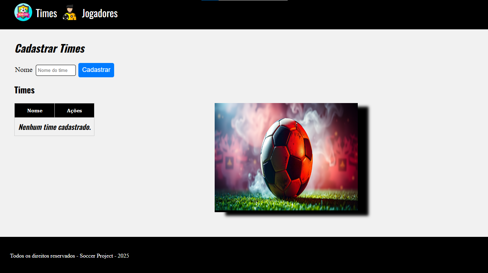

---

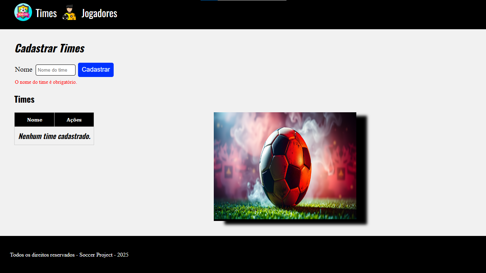

---

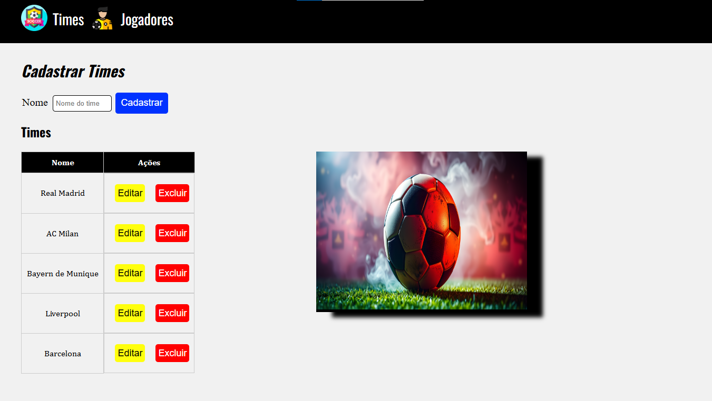

---

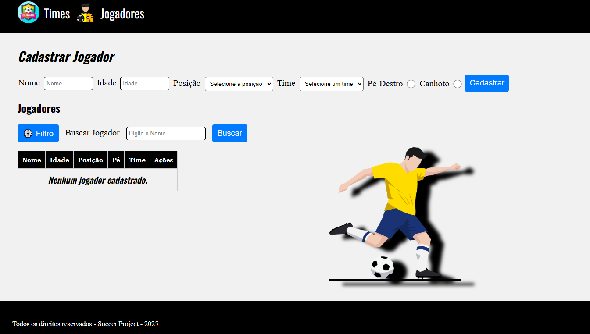

---

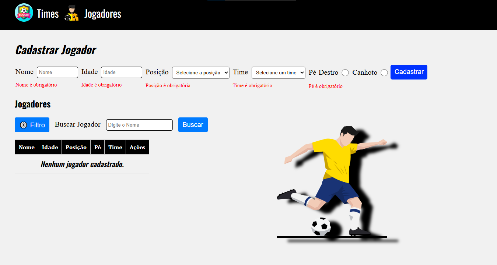

---

---

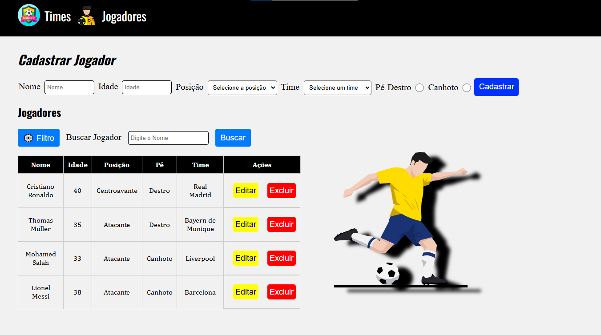

---

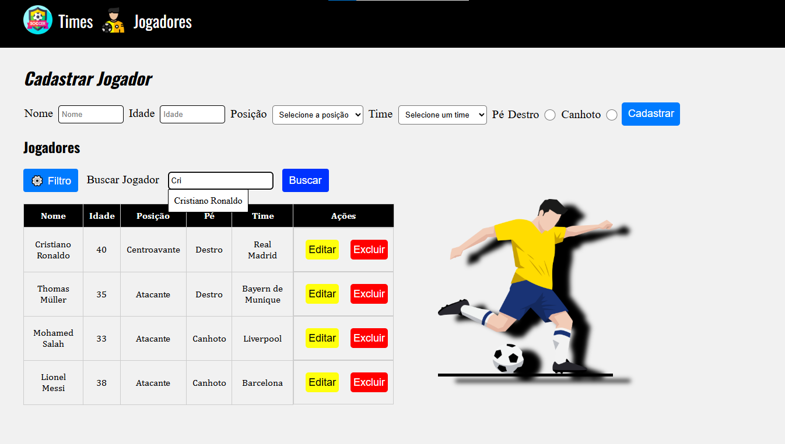

---

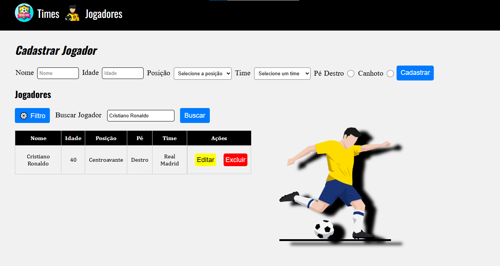

---

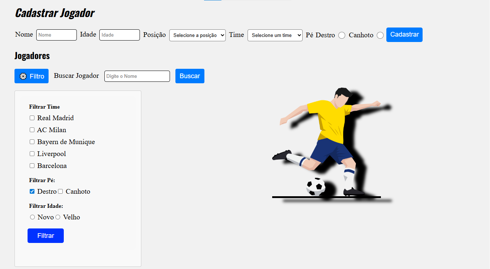

---

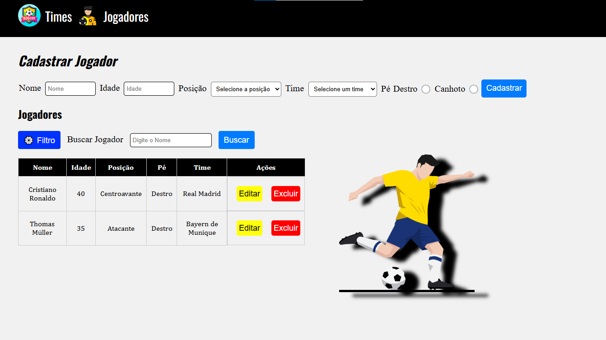

---

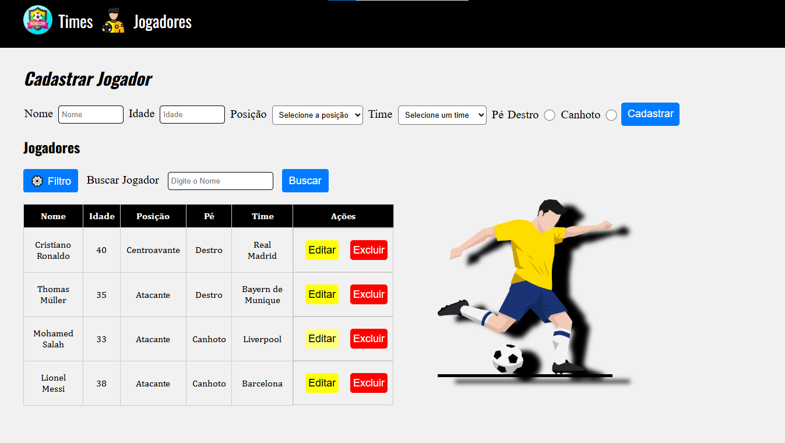

---

---

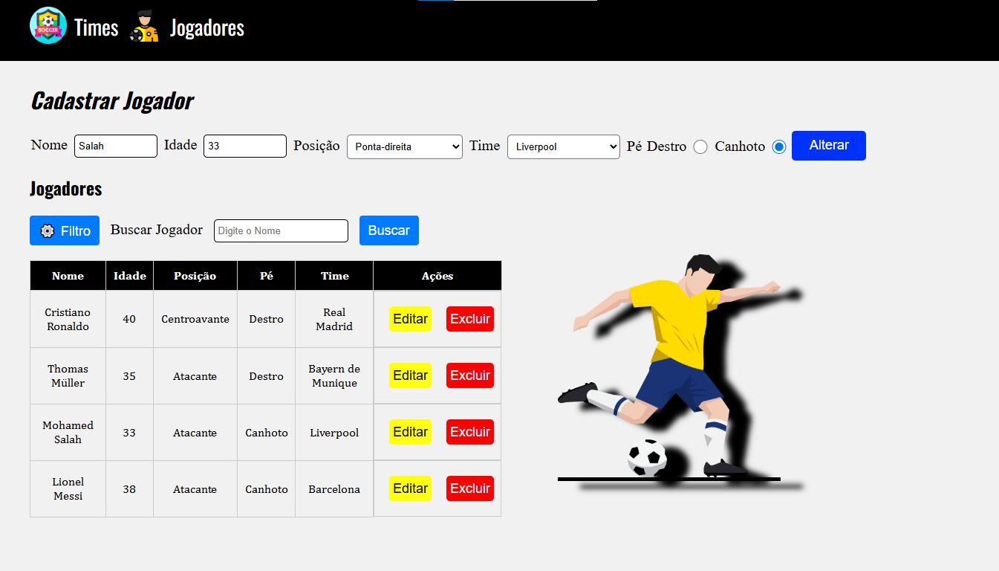

---

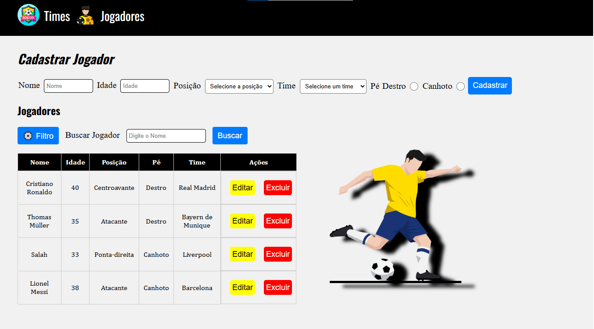

---

---

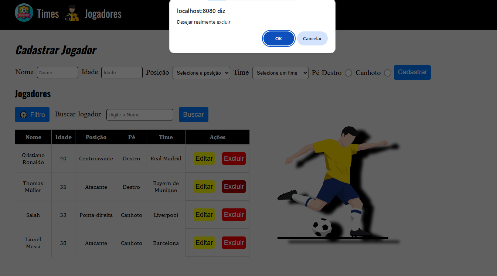

---

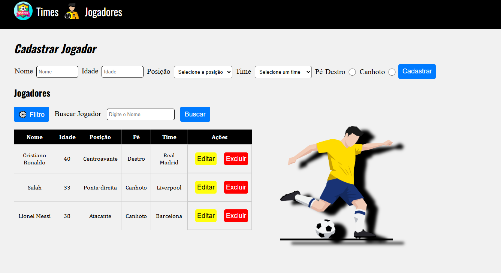

---

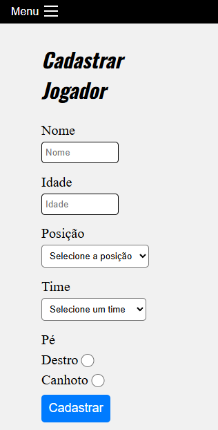

---

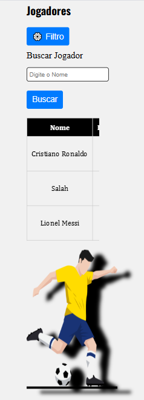

---

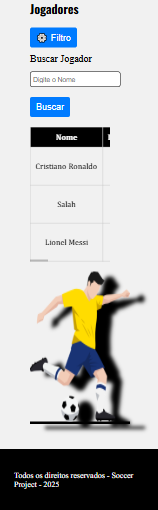

---

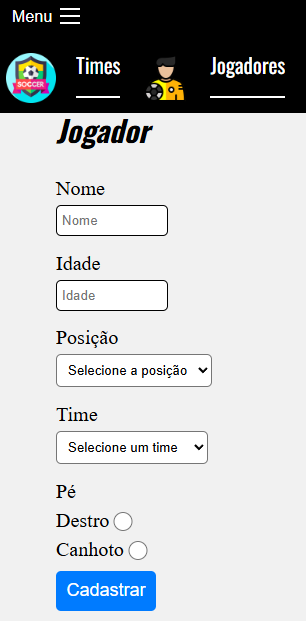

---

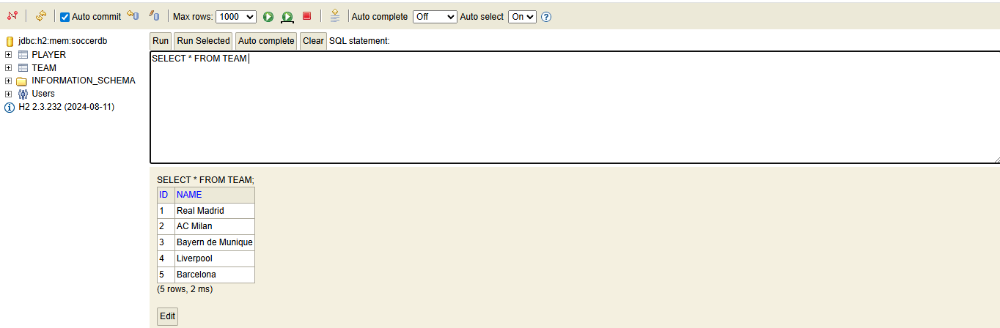

---

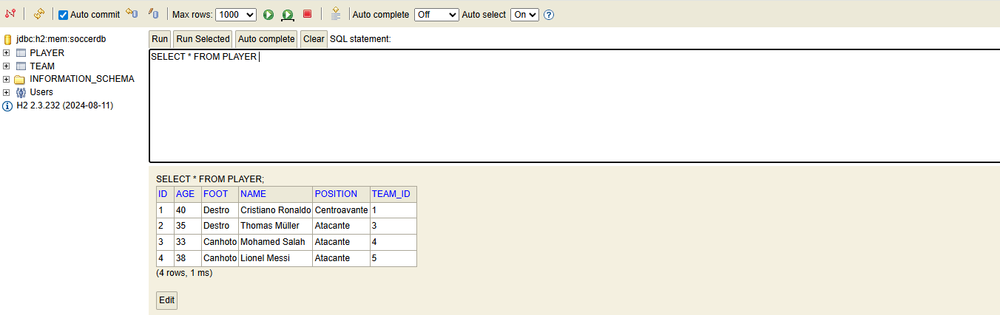

